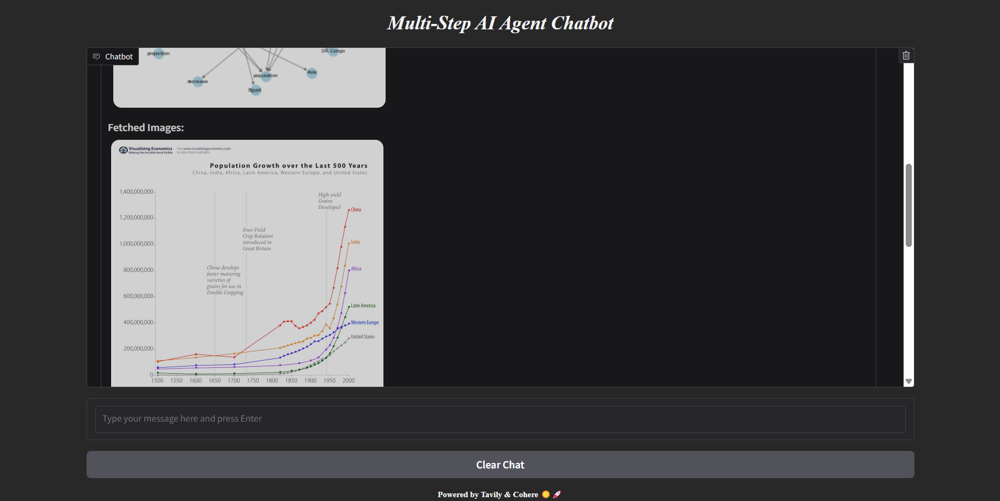

# Multi-Step AI Agent Chatbot

This project is a Multi-Step AI Agent Chatbot that uses Tavily and Cohere APIs to perform web searches and generate visualizations based on user queries. The chatbot is built with Gradio for an interactive UI.

---

## Features

1. **Web Search**: Utilizes Tavily API to fetch detailed web search results.
2. **Code Generation**: Employs Cohere API to generate Python code that visualizes the search results as Word Association Networks.
3. **Dynamic Visualization**: Executes the generated code and displays the resulting visualizations.
4. **Image Retrieval**: Fetches images related to the search query from the web.
5. **User Interface**: Built with Gradio, featuring a responsive chat UI and image gallery.

---

## Requirements

To run this project, the following Python packages are required:

```bash
pip install requests cohere matplotlib pillow gradio tavily
```

---

## Usage

1. Clone the repository:
```bash
git clone https://github.com/Sreeja-Nukarapu/Multistep-AI-Chatbot.git
cd Multistep-AI-Chatbot
```

2. Install the required dependencies:
```bash
pip install -r requirements.txt
```

3. Run the chatbot:
```bash
python MSv3.py
```

4. Access the chatbot at `http://localhost:7860` in your web browser.

---

## Main Components

### 1. **Backend Functions**
- **`tavily_search(query)`**: Searches the web using Tavily API.
- **`cohere_play(search_results, query)`**: Generates visualization code using Cohere API.
- **`extract_code(text)`**: Extracts Python code from Cohere's generated text.
- **`execute_generated_code(code_str)`**: Executes dynamically generated code and captures the output as an image.
- **`fetch_images_from_urls(search_results)`**: Retrieves images from the web search results.
- **`pil_to_base64(image)`**: Converts PIL images to base64 for HTML embedding.
- **`chatbot(query)`**: Integrates all functions to provide search results, visualizations, and image galleries.

### 2. **User Interface (Gradio)**
- **`respond_chat(user_message, history)`**: Manages user input and bot responses.
- **`Gradio UI Layout`**: Custom CSS for a clean, user-friendly interface.



---

## API Keys

This project uses the following APIs:
- **Tavily API**: For web search functionality.
- **Cohere API**: For generating Python code.

Make sure to replace the placeholder API keys in the script with your own valid keys.

---

## Customization

You can modify the chatbot's behavior by tweaking the:
- **Prompt templates** in `cohere_play()`
- **Visualization logic** in `execute_generated_code()`
- **UI Design** in the Gradio layout section

---

## Acknowledgments

- Powered by [Tavily](https://tavily.com) & [Cohere](https://cohere.com) for AI and web search functionalities.
- Built with [Gradio](https://gradio.app) for a responsive UI.

---

## License

This project is licensed under the MIT License. Feel free to modify and distribute it as needed.

---
